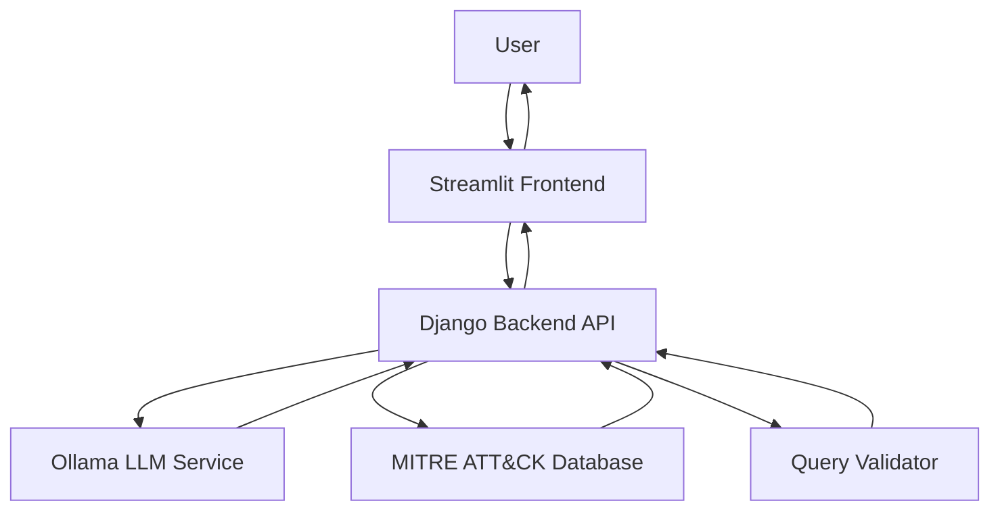

# System Architecture

## Overview

The Threat Hunting Query Generator is a web-based application that converts natural language descriptions into threat hunting queries for various security platforms. The system uses local LLMs for query generation and integrates with the MITRE ATT&CK framework for contextual threat intelligence.

## Components

### 1. Frontend (Streamlit)

- User interface for entering natural language threat descriptions
- Selection of query types (SPL, KQL, DSL)
- Display of generated queries with explanations
- MITRE ATT&CK technique mapping
- Query validation results

### 2. Backend (Django)

- REST API endpoints for query generation
- Integration with Ollama for local LLM inference
- Query generation logic for different platforms
- MITRE ATT&CK framework integration
- Query validation and optimization

### 3. Local LLM (Ollama)

- Runs Llama 3.1, Mistral, or Gemma 2 models locally
- Provides privacy-preserving query generation
- API interface for prompt processing

### 4. MITRE ATT&CK Integration

- Maps threat descriptions to ATT&CK techniques
- Provides contextual threat intelligence
- Enhances query generation with tactical knowledge

## Data Flow

## Query Generation Process

1. User enters natural language threat description
2. Frontend sends request to Django backend
3. Backend formats prompt for selected query type
4. Prompt is sent to local LLM via Ollama
5. LLM generates query and explanation
6. Query is validated for syntax and best practices
7. MITRE ATT&CK mapping is performed if requested
8. Results are returned to frontend for display

## Security Considerations

- All processing happens locally for privacy
- No data leaves the user's environment
- Secure API endpoints with CSRF protection
- Input validation and sanitization

## Deployment Options

### Development

- Run locally with Django development server
- Ollama service running on localhost
- Streamlit frontend for UI

### Production

- Docker containers for backend and frontend
- nginx reverse proxy
- Gunicorn for Django application server
- Systemd services for process management
